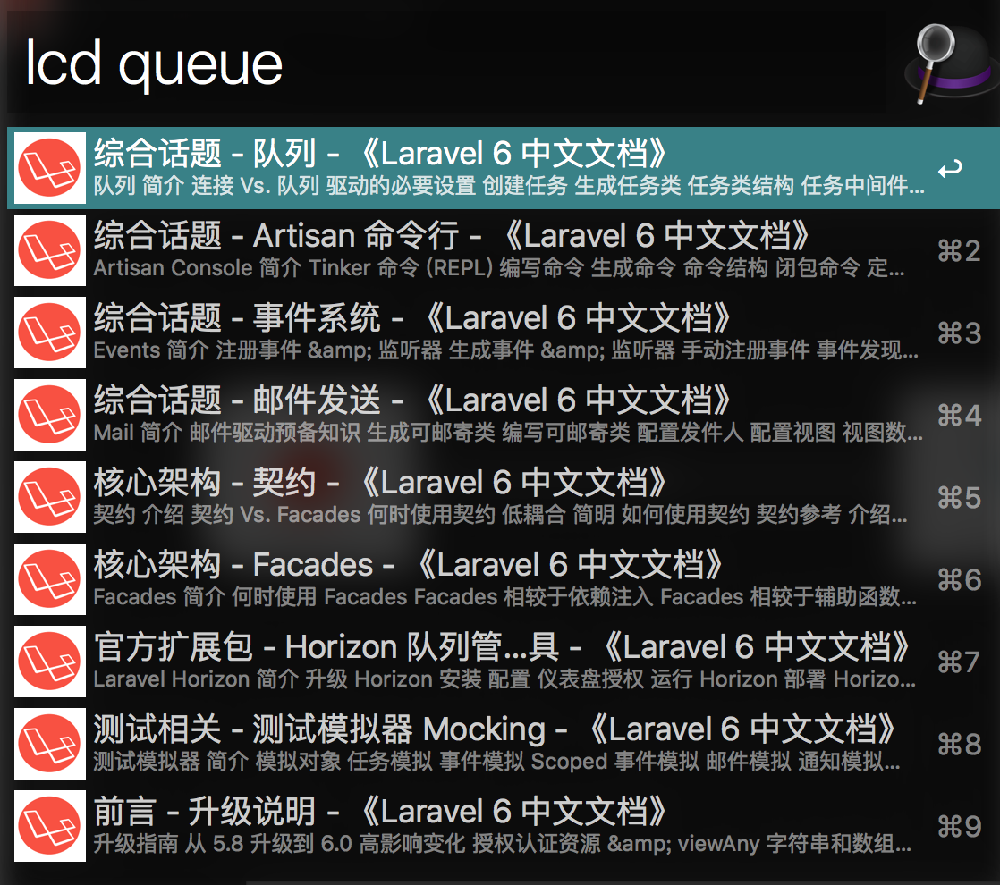

# Laravel CN Docs Workflow for Alfred

An ultra-fast Laravel CN docs search workflow for Alfred 3.



## Installation

1. Download the latest version.([v1.0.0](https://github.com/reallyli/alfred-laravel-cn-docs-workflow/releases))
2. Install the workflow by double-clicking the `.alfredworkflow` file
3. You can add the workflow to a category, then click "Import" to finish importing.

## Usage

Just type `lcd` followed by your search query. 

```
lcd <query>
```

# Links

- Fork from [Alfred Laravel Docs](https://github.com/tillkruss/alfred-laravel-docs)
- Source from [LearnKu](https://learnku.com/laravel)
